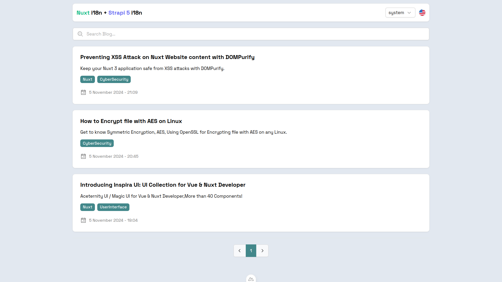
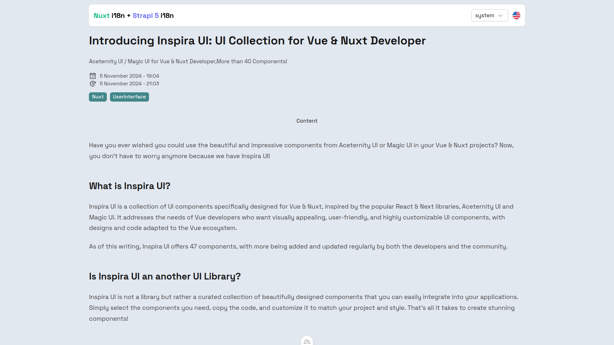

# Nuxt 3 + Strapi 5 - i18n / Multilingual Blog Demo

This project serves as a showcase or demo of how to use Nuxt 3, Nuxt i18n, and Strapi 5 to build a multilingual blog.

## Screenshots

Index

Blog Page

## See it live!

- Coming Soon, 
